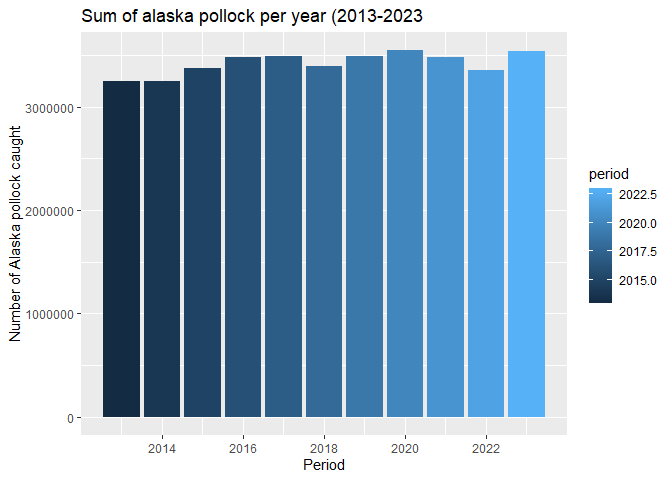

## Instructions
Answer the following questions and/or complete the exercises in RMarkdown. Please embed all of your code and push the final work to your repository. Your report should be organized, clean, and run free from errors. Remember, you must remove the `#` for any included code chunks to run.  

## Load the libraries

``` r
library("tidyverse")
library("janitor")
#library("naniar")
options(scipen = 999)
```

## About the Data
For this assignment we are going to work with a data set from the [United Nations Food and Agriculture Organization](https://www.fao.org/fishery/en/collection/capture) on world fisheries. These data were downloaded and cleaned using the `fisheries_clean.Rmd` script.  

Load the data `fisheries_clean.csv` as a new object titled `fisheries_clean`.

``` r
fisheries_clean <- read_csv("data/fisheries_clean.csv")
```

1. Explore the data. What are the names of the variables, what are the dimensions, are there any NA's, what are the classes of the variables, etc.? You may use the functions that you prefer.

``` r
names(fisheries_clean)
```

```
## [1] "period"          "continent"       "geo_region"      "country"        
## [5] "scientific_name" "common_name"     "taxonomic_code"  "catch"          
## [9] "status"
```

``` r
summary(fisheries_clean)
```

```
##      period      continent          geo_region          country         
##  Min.   :1950   Length:1055015     Length:1055015     Length:1055015    
##  1st Qu.:1980   Class :character   Class :character   Class :character  
##  Median :1996   Mode  :character   Mode  :character   Mode  :character  
##  Mean   :1994                                                           
##  3rd Qu.:2010                                                           
##  Max.   :2023                                                           
##  scientific_name    common_name        taxonomic_code         catch           
##  Length:1055015     Length:1055015     Length:1055015     Min.   :       0.0  
##  Class :character   Class :character   Class :character   1st Qu.:       0.0  
##  Mode  :character   Mode  :character   Mode  :character   Median :       2.9  
##                                                           Mean   :    5089.9  
##                                                           3rd Qu.:     400.0  
##                                                           Max.   :12277000.0  
##     status         
##  Length:1055015    
##  Class :character  
##  Mode  :character  
##                    
##                    
## 
```

``` r
glimpse(fisheries_clean)
```

```
## Rows: 1,055,015
## Columns: 9
## $ period          <dbl> 1950, 1951, 1952, 1953, 1954, 1955, 1956, 1957, 1958, …
## $ continent       <chr> "Asia", "Asia", "Asia", "Asia", "Asia", "Asia", "Asia"…
## $ geo_region      <chr> "Southern Asia", "Southern Asia", "Southern Asia", "So…
## $ country         <chr> "Afghanistan", "Afghanistan", "Afghanistan", "Afghanis…
## $ scientific_name <chr> "Osteichthyes", "Osteichthyes", "Osteichthyes", "Ostei…
## $ common_name     <chr> "Freshwater fishes NEI", "Freshwater fishes NEI", "Fre…
## $ taxonomic_code  <chr> "1990XXXXXXXX106", "1990XXXXXXXX106", "1990XXXXXXXX106…
## $ catch           <dbl> 100, 100, 100, 100, 100, 200, 200, 200, 200, 200, 200,…
## $ status          <chr> "A", "A", "A", "A", "A", "A", "A", "A", "A", "A", "A",…
```

2. Convert the following variables to factors: `period`, `continent`, `geo_region`, `country`, `scientific_name`, `common_name`, `taxonomic_code`, and `status`.

``` r
fisheries_clean %>% 
  summarize(across(where(is.character), as.factor))
```

```
## Warning: Returning more (or less) than 1 row per `summarise()` group was deprecated in
## dplyr 1.1.0.
## ℹ Please use `reframe()` instead.
## ℹ When switching from `summarise()` to `reframe()`, remember that `reframe()`
##   always returns an ungrouped data frame and adjust accordingly.
## Call `lifecycle::last_lifecycle_warnings()` to see where this warning was
## generated.
```

```
## # A tibble: 1,055,015 × 7
##    continent geo_region    country    scientific_name common_name taxonomic_code
##    <fct>     <fct>         <fct>      <fct>           <fct>       <fct>         
##  1 Asia      Southern Asia Afghanist… Osteichthyes    Freshwater… 1990XXXXXXXX1…
##  2 Asia      Southern Asia Afghanist… Osteichthyes    Freshwater… 1990XXXXXXXX1…
##  3 Asia      Southern Asia Afghanist… Osteichthyes    Freshwater… 1990XXXXXXXX1…
##  4 Asia      Southern Asia Afghanist… Osteichthyes    Freshwater… 1990XXXXXXXX1…
##  5 Asia      Southern Asia Afghanist… Osteichthyes    Freshwater… 1990XXXXXXXX1…
##  6 Asia      Southern Asia Afghanist… Osteichthyes    Freshwater… 1990XXXXXXXX1…
##  7 Asia      Southern Asia Afghanist… Osteichthyes    Freshwater… 1990XXXXXXXX1…
##  8 Asia      Southern Asia Afghanist… Osteichthyes    Freshwater… 1990XXXXXXXX1…
##  9 Asia      Southern Asia Afghanist… Osteichthyes    Freshwater… 1990XXXXXXXX1…
## 10 Asia      Southern Asia Afghanist… Osteichthyes    Freshwater… 1990XXXXXXXX1…
## # ℹ 1,055,005 more rows
## # ℹ 1 more variable: status <fct>
```

3. Are there any missing values in the data? If so, which variables contain missing values and how many are missing for each variable?

``` r
#skip number three, dont install naniar
```

4. How many countries are represented in the data?

``` r
fisheries_clean %>% 
select(country) %>% 
  summarize(countries_number= n_distinct (country))
```

```
## # A tibble: 1 × 1
##   countries_number
##              <int>
## 1              249
```

5. The variables `common_name` and `taxonomic_code` both refer to species. How many unique species are represented in the data based on each of these variables? Are the numbers the same or different?

``` r
fisheries_clean %>% 
select(common_name) %>% 
  summarise(number_of_sepcies= n_distinct(common_name))
```

```
## # A tibble: 1 × 1
##   number_of_sepcies
##               <int>
## 1              3390
```

6. In 2023, what were the top five countries that had the highest overall catch?

``` r
 fisheries_clean %>% 
  filter(period=="2023") %>% 
  group_by(country) %>% 
  summarise(avg_catch=sum(catch, na.rm=T)) %>% 
  arrange(desc(avg_catch))
```

```
## # A tibble: 238 × 2
##    country                  avg_catch
##    <chr>                        <dbl>
##  1 China                    13424705.
##  2 Indonesia                 7820833.
##  3 India                     6177985.
##  4 Russian Federation        5398032 
##  5 United States of America  4623694 
##  6 Peru                      3519381.
##  7 Viet Nam                  3417238.
##  8 Japan                     2904942.
##  9 Chile                     2596488.
## 10 Norway                    2546846.
## # ℹ 228 more rows
```

7. In 2023, what were the top 10 most caught species? To keep things simple, assume `common_name` is sufficient to identify species. What does `NEI` stand for in some of the common names? How might this be concerning from a fisheries management perspective?

``` r
 fisheries_clean %>% 
  filter(period=="2023") %>% 
  group_by(common_name) %>% 
  summarise(number_caught=sum(catch)) %>% 
  arrange(desc(number_caught))
```

```
## # A tibble: 2,870 × 2
##    common_name                    number_caught
##    <chr>                                  <dbl>
##  1 Marine fishes NEI                   8553907.
##  2 Freshwater fishes NEI               5880104.
##  3 Alaska pollock(=Walleye poll.)      3543411.
##  4 Skipjack tuna                       2954736.
##  5 Anchoveta(=Peruvian anchovy)        2415709.
##  6 Blue whiting(=Poutassou)            1739484.
##  7 Pacific sardine                     1678237.
##  8 Yellowfin tuna                      1601369.
##  9 Atlantic herring                    1432807.
## 10 Scads NEI                           1344190.
## # ℹ 2,860 more rows
```
NEI means, not elsewhere included,
8. For the species that was caught the most above (not NEI), which country had the highest catch in 2023?

``` r
fisheries_clean %>% 
  filter(period=="2023", common_name=="Alaska pollock(=Walleye poll.)") %>% 
  group_by(country) %>% 
  summarise(number_caught=sum(catch)) %>% 
  arrange(desc(number_caught))
```

```
## # A tibble: 6 × 2
##   country                               number_caught
##   <chr>                                         <dbl>
## 1 Russian Federation                         1893924 
## 2 United States of America                   1433538 
## 3 Japan                                       122900 
## 4 Democratic People's Republic of Korea        58730 
## 5 Republic of Korea                            28432.
## 6 Canada                                        5887.
```
russian federation caught the most alaska polluck

9. How has fishing of this species changed over the last decade (2013-2023)? Create a  plot showing total catch by year for this species.


``` r
  fisheries_clean %>% 
  filter(period >= "2013",common_name== "Alaska pollock(=walleye poll.)") %>% 
  group_by(period) %>% 
  summarize(total_catch=sum(catch)) %>% 
  ggplot
```

<!-- -->


``` r
 fisheries_clean %>% 
  select(period, common_name, catch) %>% 
  filter(period >= "2013", common_name=="Alaska pollock(=Walleye poll.)") %>% 
  group_by(period) %>% 
  summarize(Catch_sum= sum(catch)) %>% 
  ggplot(mapping = aes(x=period, y= Catch_sum))+
  geom_col(mapping = aes(fill=period))+
  labs(title = "Sum of alaska pollock per year (2013-2023", x="Period", y= "Number of Alaska pollock caught")
```

<!-- -->

10. Perform one exploratory analysis of your choice. Make sure to clearly state the question you are asking before writing any code.

``` r
names(fisheries_clean)
```

```
## [1] "period"          "continent"       "geo_region"      "country"        
## [5] "scientific_name" "common_name"     "taxonomic_code"  "catch"          
## [9] "status"
```
what year had the largest amount of fish caught, which country caught the most fish that year? 


``` r
fisheries_clean %>% 
  group_by(period) %>% 
  summarise(avg_catch=sum(catch, na.rm=T)) %>% 
  arrange(desc(avg_catch))
```

```
## # A tibble: 74 × 2
##    period avg_catch
##     <dbl>     <dbl>
##  1   2018 99039627.
##  2   1996 96722828.
##  3   2000 96581944.
##  4   2004 96222870.
##  5   1997 96003718.
##  6   2017 95975677.
##  7   2005 95844883.
##  8   1995 95185361.
##  9   2019 95147897.
## 10   1999 94722921.
## # ℹ 64 more rows
```

``` r
fisheries_clean %>% 
  filter(period=="2018") %>% 
  group_by(country) %>% 
  summarise(avg_catch=sum(catch, na.rm=T)) %>% 
  arrange(desc(avg_catch))
```

```
## # A tibble: 241 × 2
##    country                  avg_catch
##    <chr>                        <dbl>
##  1 China                    14831109.
##  2 Indonesia                 7316475.
##  3 Peru                      7208637.
##  4 United States of America  5395806 
##  5 India                     5336183.
##  6 Russian Federation        5128230.
##  7 Viet Nam                  3386291 
##  8 Japan                     3383709.
##  9 Norway                    2671006.
## 10 Chile                     2371683.
## # ℹ 231 more rows
```
china seems to be commonly the largest fish catching country, which makes sense for its size/population, as well as how much export it commonly has

Please knit your work as an .html file and upload to Canvas. Homework is due before the start of the next lab. No late work is accepted. Make sure to use the formatting conventions of RMarkdown to make your report neat and clean!  
